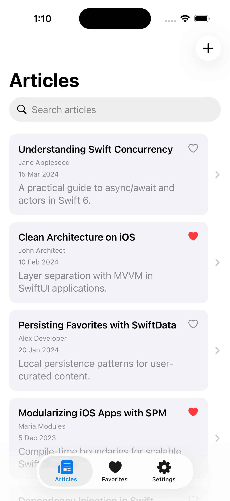
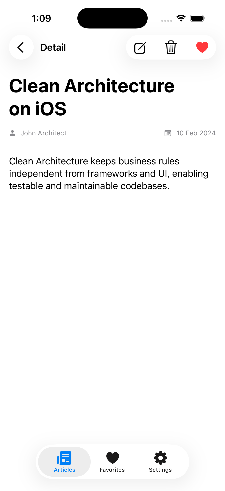
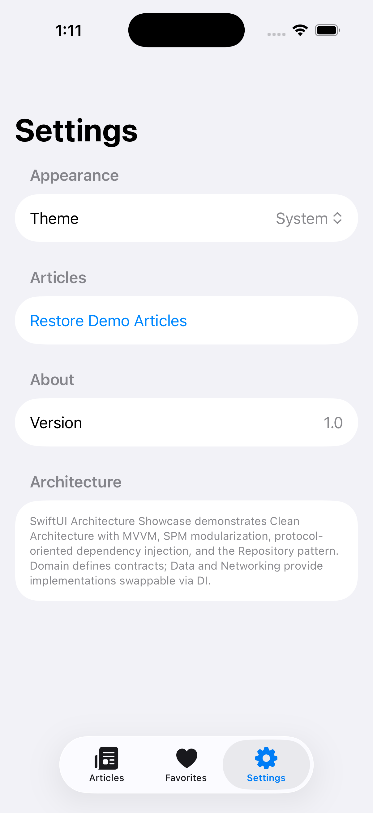

# SwiftUI Architecture Showcase


Production-inspired iOS portfolio project demonstrating **Clean Architecture**, **MVVM**, **SPM modularization**, **dependency injection**, and **comprehensive testing**.

The Articles app supports **local CRUD** (create, read, update, delete) with SwiftData persistence, plus search, favorites, and settings.

## Screenshots

| Articles | Detail | Settings |
|:--------:|:------:|:--------:|
|  |  |  |

## Articles Data

- **Default storage**: SwiftData (`ArticleModel`) with full CRUD
- **Demo content**: bundled `articles.json` seeds on first launch; restore anytime via **Settings → Restore Demo Articles**
- **Remote API**: prepared in the `Networking` module, inactive by default — see [ADR-003](docs/adr/ADR-003-local-json-vs-remote-api.md)

## Architecture

See [docs/architecture.md](docs/architecture.md) for layer responsibilities, dependency rules, and testing strategy.

## Modules

```text
Packages/
├── Core/              # Errors, logging, ViewState
├── Domain/            # Entities, use cases, repository protocols
├── Data/              # Repositories, DTOs, mappers, SwiftData
├── Networking/        # URLSession client and endpoints
├── DesignSystem/      # Reusable UI components
├── FeatureArticles/   # Core (ViewModels) + UI (Views)
├── FeatureFavorites/  # Core + UI
├── FeatureSettings/   # Core + UI
└── SharedTesting/     # Fixtures and mocks
```

## Getting Started

```bash
git clone https://github.com/rafaelasenciodev/showcase.git
cd showcase
open showcase.xcodeproj
```

Run on an iOS 17+ simulator (⌘R).

```bash
xcodebuild build -scheme showcase \
  -destination 'platform=iOS Simulator,name=iPhone 17'
```

Run all package tests from the repo root (works on macOS, no simulator required):

```bash
./scripts/run-package-tests.sh
```

For full app + UI tests in Xcode:

```bash
xcodebuild test -scheme showcase \
  -destination 'platform=iOS Simulator,name=iPhone 17'
```

## Architectural Decisions

| ADR | Topic |
|-----|-------|
| [ADR-001](docs/adr/ADR-001-architecture-selection.md) | Clean Architecture + MVVM |
| [ADR-002](docs/adr/ADR-002-dependency-injection.md) | Constructor injection |
| [ADR-003](docs/adr/ADR-003-local-json-vs-remote-api.md) | SwiftData CRUD + demo seed vs remote API |

## Testing

- **Swift Testing** — domain use cases, repositories, mappers, ViewModels
- **XCTest** — UI smoke tests
- **SharedTesting** — reusable mocks and fixtures across packages

## CI

GitHub Actions (`.github/workflows/ci.yml`) runs build, tests, and SPM package validation on every push.

## Requirements

- Xcode 16+
- iOS 17+ deployment target
- Swift 6

## License

[MIT](LICENSE)
