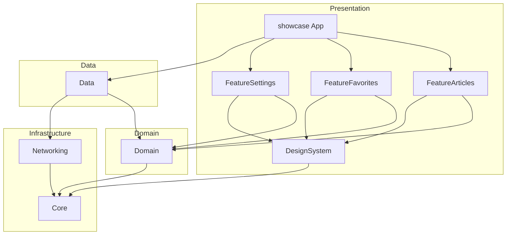

# Architecture

**SwiftUI Architecture Showcase** — iOS 17+, Swift 6, SwiftUI.

## Overview

The app follows **Clean Architecture** with **MVVM** in the Presentation layer. Dependencies point inward: outer layers depend on abstractions defined by inner layers, never the reverse.



## Layer Responsibilities

### Presentation

| Module | Role |
|--------|------|
| `showcase` | Composition root, `TabView`, SwiftData container |
| `FeatureArticles` | List, detail, search, pull-to-refresh |
| `FeatureFavorites` | Favorites tab |
| `FeatureSettings` | Theme, version, architecture info |
| `DesignSystem` | Buttons, cards, loading/empty/error states |

- Views are declarative — no repository calls or DTO parsing
- ViewModels are `@Observable` and receive use cases via constructor injection
- Navigation uses `NavigationStack` with value-based routing

### Domain

- **Entities**: `Article`, `FavoriteArticle`, `AppSettings`, `SearchQuery`
- **Use cases**: one per user action (`FetchArticlesUseCase`, `ToggleFavoriteUseCase`, …)
- **Protocols**: `ArticleRepositoryProtocol`, `FavoriteRepositoryProtocol`, `SettingsRepositoryProtocol`

No imports from Data, Networking, Feature modules, SwiftUI, or SwiftData.

### Data

- Repository implementations (`LocalArticleRepository`, `RemoteArticleRepository`, …)
- DTOs, mappers, local JSON bundle, SwiftData models
- Swappable data sources behind domain protocols

### Infrastructure

| Module | Role |
|--------|------|
| `Core` | `DomainError`, logging, `ViewState`, DI marker protocol |
| `Networking` | `URLSessionAPIClient`, endpoints, network errors |

## Dependency Injection

A single **`LiveDependencyContainer`** in the App target wires concrete implementations at launch. ViewModels are cached to preserve state across SwiftUI re-renders.

```text
showcaseApp → LiveDependencyContainer → Use Cases → Repository Protocols → Implementations
```

See [ADR-002](adr/ADR-002-dependency-injection.md).

## Data Strategy

| Phase | Source | Status |
|-------|--------|--------|
| 1 | Bundled `articles.json` | Active default |
| 2 | URLSession remote API | Implemented, switch via `DataSourceConfiguration` |

Presentation and Domain layers are unchanged when swapping sources. See [ADR-003](adr/ADR-003-local-json-vs-remote-api.md).

## Module Dependency Rules

```text
Feature* → Domain, DesignSystem, Core
Data → Domain, Networking, Core
Domain → Core
DesignSystem → Core
Networking → Core
```

Forbidden: `Domain → Data`, `Feature → Data`, upward dependencies of any kind.

## Testing Strategy

| Layer | Framework | Focus |
|-------|-----------|-------|
| Use cases | Swift Testing | Business rules, error propagation |
| Repositories / mappers | Swift Testing | Mapping, data source behaviour |
| ViewModels | Swift Testing | State transitions |
| UI smoke | XCTest | Tab navigation |

`SharedTesting` provides `MockArticleRepository`, `MockFavoriteRepository`, and `ArticleFixtures`.

## Branching Model

```text
main → develop → feature/*
```

`main` is stable. Integration happens on `develop`. Feature work uses short-lived branches (e.g. `feature/showcase`).

## Related Documents

- [ADR-001: Architecture Selection](adr/ADR-001-architecture-selection.md)
- [ADR-002: Dependency Injection](adr/ADR-002-dependency-injection.md)
- [ADR-003: Local JSON vs Remote API](adr/ADR-003-local-json-vs-remote-api.md)
